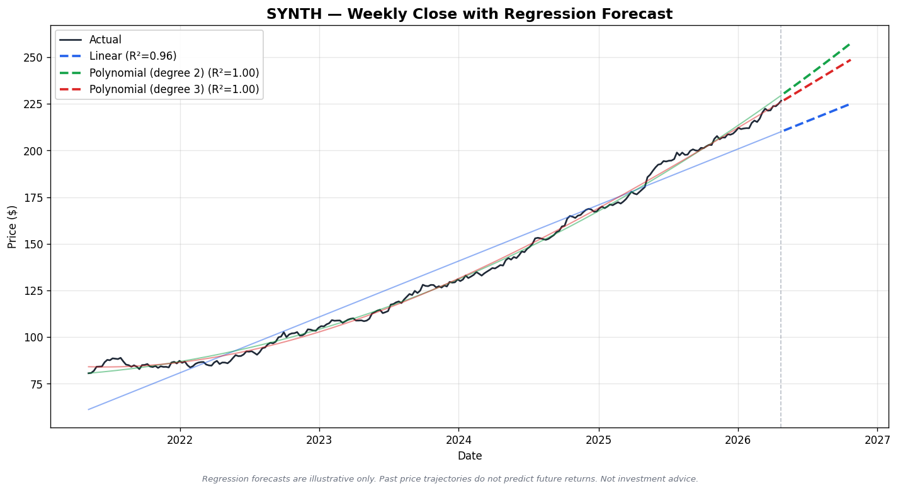

# Stock price forecasting (Claude Skill)

A [Claude Skill](https://support.claude.com/en/articles/12512180-use-skills-in-claude) that drives a small Python pipeline: download weekly prices from Yahoo Finance, fit linear and polynomial regressions, and render static and interactive forecast charts. The repository is laid out for publishing: skill package, example outputs, and a reproducible zip build.

> **Not investment advice.** Regression on past prices is for illustration and learning only. See the disclaimer inside the skill and on generated charts.



## Repository layout

| Path | Purpose |
|------|--------|
| `stock-forecast/` | **Skill package**—`SKILL.md`, `requirements.txt`, `scripts/`, `references/` (this is what you upload or copy into a skills directory) |
| `examples/` | Sample PNG and HTML produced by the pipeline (for documentation and design reference) |
| `scripts/package-skill.sh` | Creates `dist/stock-forecast.skill` (see [Packaging](#packaging) below) |
| `LICENSE` | MIT |

The skill’s operational instructions and disclaimers live in `stock-forecast/SKILL.md`, not in this README, so the agent’s behavior stays the single source of truth inside the package.

## Using this as a Claude Skill

Claude’s product UI and limits can change; these steps match the current [“How to create custom Skills”](https://support.claude.com/en/articles/12512198-how-to-create-custom-skills) guidance.

### Requirements

- **Claude** with [code execution](https://support.claude.com/en/articles/12111783-create-and-edit-files-with-claude) enabled (Skills that run Python depend on this where applicable).
- **Python 3.10+** on the environment where the skill’s scripts will run, with dependencies from `stock-forecast/requirements.txt`.

### Install: Claude (claude.ai / Claude app)

1. **Package the folder** (zip must contain the skill folder as the top-level entry—not loose files in the root of the zip):

   ```bash
   ./scripts/package-skill.sh
   ```

   This writes `dist/stock-forecast.skill` (a zip). You can rename to `stock-forecast.zip` if you prefer; what matters is the **internal** structure: `stock-forecast/…` at the root of the archive.

2. In Claude, open **Settings → Capabilities → Skills** (or **Customize → Skills** per your client) and **upload** the generated archive.

3. **Enable** the skill for the conversations where you want it available, then try prompts that match the [skill description](stock-forecast/SKILL.md) (e.g. “Forecast AAPL 26 weeks with defaults”).

4. If the skill rarely triggers, tighten or broaden the YAML **`description`** in `SKILL.md` (Claude uses it for routing; Anthropic currently documents a **200-character** cap on that field).

### Install: Claude Code

Place the `stock-forecast` directory where your **Claude Code** skills are loaded (e.g. project or user skills directory, depending on your setup). The folder name should stay **`stock-forecast`** so it lines up with the `name` field in the frontmatter. Restart or reload the tool list if your client caches skills.

Relevant pointers:

- [Claude Code](https://code.claude.com) documentation for skills and plugins as updated by Anthropic.
- [Agent skills specification](https://agentskills.io) for cross-tool compatibility.

## Local development (without Claude)

You can run the same scripts the skill describes for testing or CI:

```bash
cd stock-forecast
python3 -m venv .venv
source .venv/bin/activate   # Windows: .venv\Scripts\activate
pip install -r requirements.txt

python scripts/fetch_data.py --ticker AAPL --years 5 --out /tmp/stock_data.csv
python scripts/forecast.py --data /tmp/stock_data.csv --horizon 26 --model all --out /tmp/forecast.csv
python scripts/visualize.py --forecast /tmp/forecast.csv --metrics /tmp/forecast_metrics.json \
  --ticker AAPL --png /tmp/forecast.png --html /tmp/forecast.html
```

## Packaging

```bash
chmod +x scripts/package-skill.sh
./scripts/package-skill.sh
```

Output: `dist/stock-forecast.skill` (ignored by git—see `.gitignore`). The archive layout matches the “folder at zip root” pattern described in the help article above.

## Examples

- [examples/sample_forecast.png](examples/sample_forecast.png) — static chart  
- [examples/sample_forecast.html](examples/sample_forecast.html) — interactive Plotly export (open in a browser)

## License

[MIT](LICENSE)

## See also

- [Regression model reference](stock-forecast/references/models.md) (bundled in the skill for the model)
